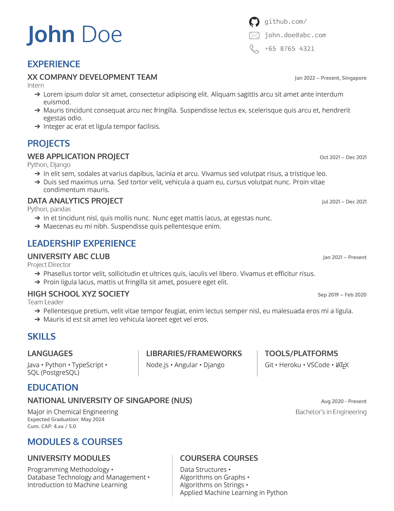

## Resume Template
Personal resume template in **XeTex** (I am an undergraduate student).

Adapted from PlushCV, a one-page two-column resume template, available on [Overleaf.com](https://www.overleaf.com/latex/templates/plushcv/jybpnsftmdkf).

<br>

## Customisations
1. Reformatted template to be single-column, with some sections having two or three columns.
2. Contacts have been restricted to three kinds only, and are placed to the right of applicant name.
3. Changed font settings including font family and sizes.

*Note: Compiles only with **XeTeX**.*

<br>

## Preview

<!--  -->

<br>

## Installing and Compiling
1. To install on Linux, run commands:
```
sudo apt update
sudo apt install texlive-full
```
2. To compile to PDF, at root directory, run:
```
xelatex ./resume.tex
```
